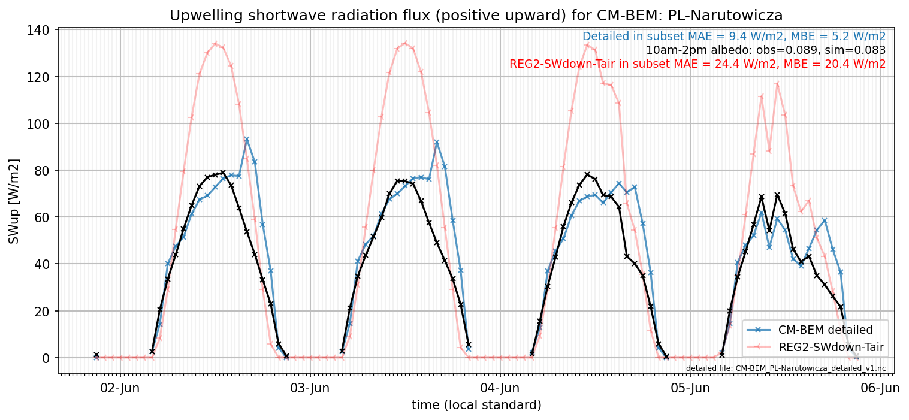

# PL-Narutowicza: CM-BEM

**NOTE:** *Results presented here are highly dependent on how models are configured in this experiment and may be subject to variable output formatting errors. Results are not intended to indicate the quality of any individual model, but to help participants better understand and improve modelling approaches in different urban environments.*

### Submitted metadata

- [Baseline](CM-BEM_PL-Narutowicza_baseline_attrs.md)
- [Detailed](CM-BEM_PL-Narutowicza_detailed_attrs.md)

### Error metrics

| flux   | experiment   |       MAE |       MBE |        nSD |          R |      5th |     95th |     RMSE |      cRMSE |      AMBE |       1-nSD |         1-R |   nSkewness |   nKurtosis |     Overlap |
|:-------|:-------------|----------:|----------:|-----------:|-----------:|---------:|---------:|---------:|-----------:|----------:|------------:|------------:|------------:|------------:|------------:|
| SWup   | baseline     | nan       | nan       | nan        | nan        | nan      | nan      | nan      | nan        | nan       | nan         | nan         |  nan        |  nan        | nan         |
| SWup   | detailed     |   8.48956 |   1.98934 |   1.11717  |   0.836713 |   0.0905 |   7.6734 |  13.4378 |   0.615277 |   1.98934 |   0.117165  |   0.163287  |    0.232227 |    2.40673  |   0.0888412 |
| LWup   | baseline     | nan       | nan       | nan        | nan        | nan      | nan      | nan      | nan        | nan       | nan         | nan         |  nan        |  nan        | nan         |
| LWup   | detailed     |  15.9333  | -10.9033  |   1.09859  |   0.968549 |  11.0251 |   9.0512 |  19.6368 |   0.280756 |  10.9033  |   0.0985947 |   0.0314508 |    0.812369 |    1.56735  |   0.138853  |
| Qle    | baseline     | nan       | nan       | nan        | nan        | nan      | nan      | nan      | nan        | nan       | nan         | nan         |  nan        |  nan        | nan         |
| Qle    | detailed     |  26.8171  | -15.1397  |   0.894939 |   0.408088 |  16.9664 |  33.7685 |  47.0633 |   1.03464  |  15.1397  |   0.105063  |   0.591912  |    2.89004  |  177.808    |   0.331323  |
| Qh     | baseline     | nan       | nan       | nan        | nan        | nan      | nan      | nan      | nan        | nan       | nan         | nan         |  nan        |  nan        | nan         |
| Qh     | detailed     |  47.5331  |  44.6575  |   1.07381  |   0.892505 |  41.3059 |  55.8895 |  57.0362 |   0.486114 |  44.6575  |   0.0738056 |   0.107495  |    0.169582 |    0.615901 |   0.419068  |

 - MAE: mean absolute error (close to 0 is better)
 - MBE: mean bias error (close to 0 is better)
 - NSD: ratio of model to obs standard deviation (close to 1 is better)
 - R: Pearson's correlation (close to 1 is better)
 - all others: closer to 0 is better

[Link to variable definitions](../modelattrs/variable_definitions.md)

### subset_SWup_v0-9

### out of range: baseline

### out of range: detailed

 - CM-BEM SWnet min value of -40.8929 is less than expected 0.0 [W/m2]
 - CM-BEM Qle max value of 1266.2836 is greater than expected 700.0 [W/m2]
 - CM-BEM Qle min value of -1482.2401 is less than expected -700.0 [W/m2]
 - CM-BEM Qanth max value of 11594.7300 is greater than expected 1000.0 [W/m2]
 - CM-BEM Qanth min value of -9469.3400 is less than expected 0.0 [W/m2]

[Link to variable definitions](../modelattrs/variable_definitions.md)

