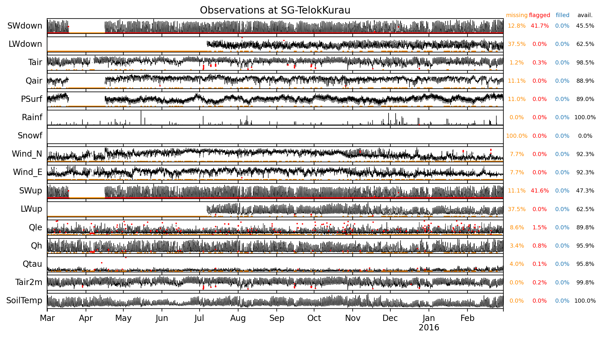
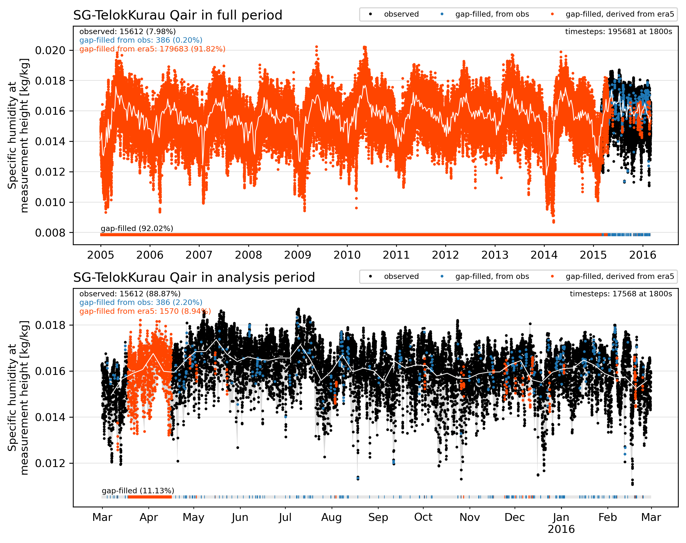
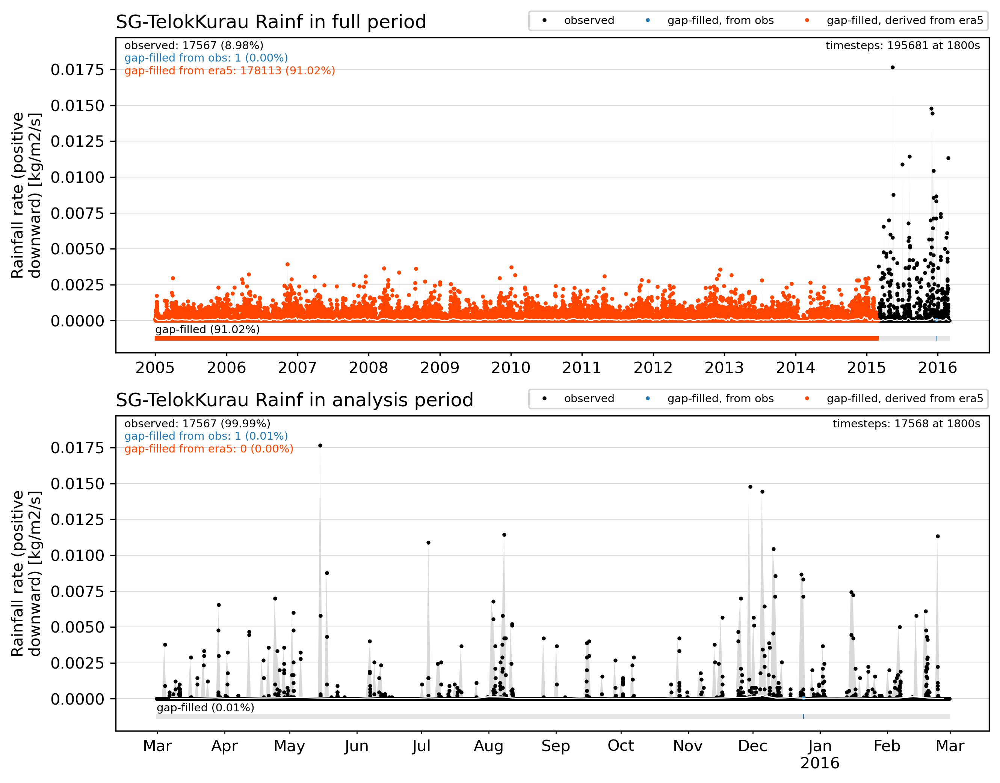
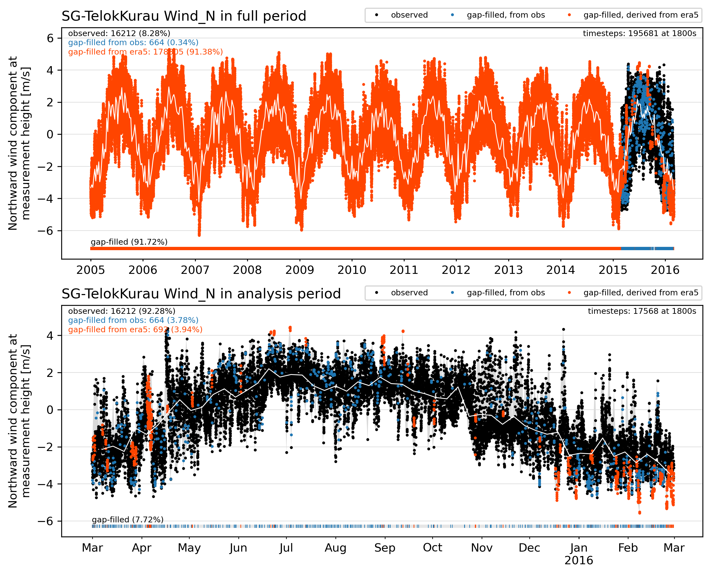
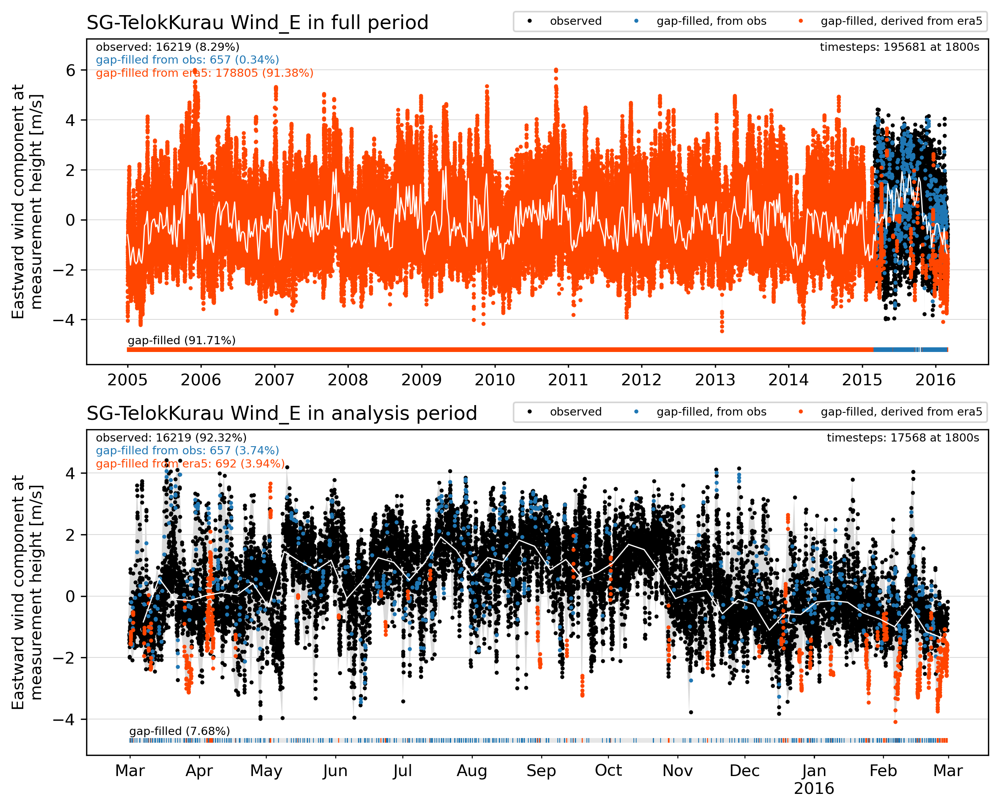
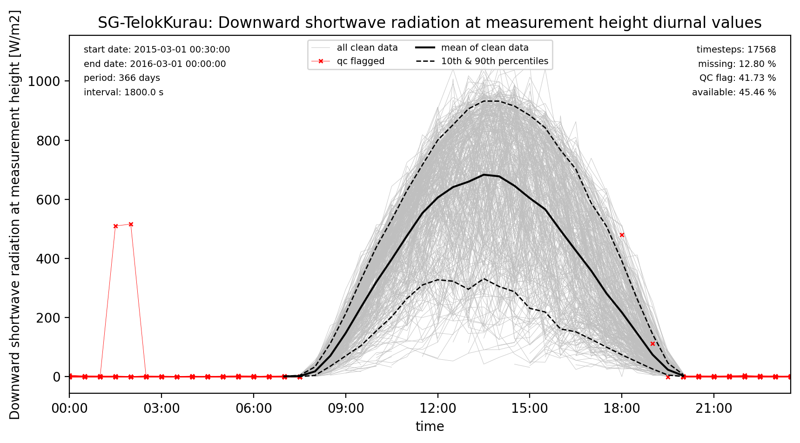
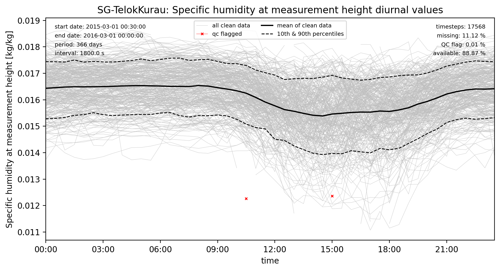
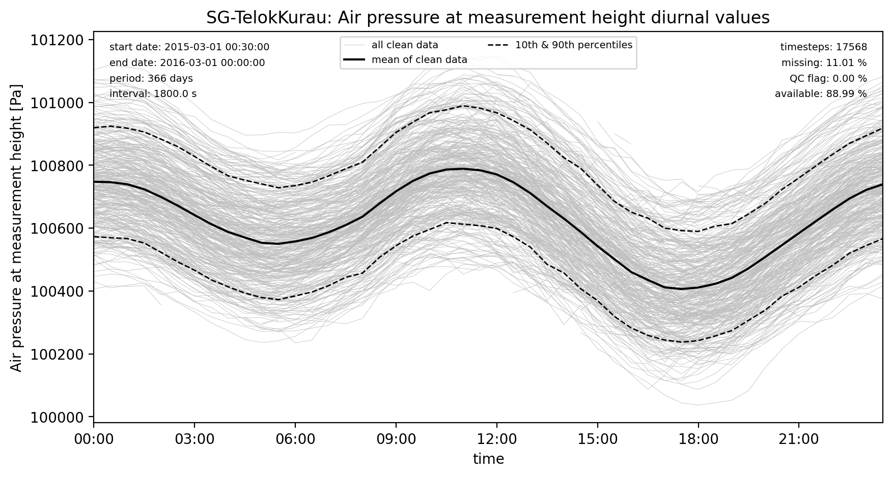
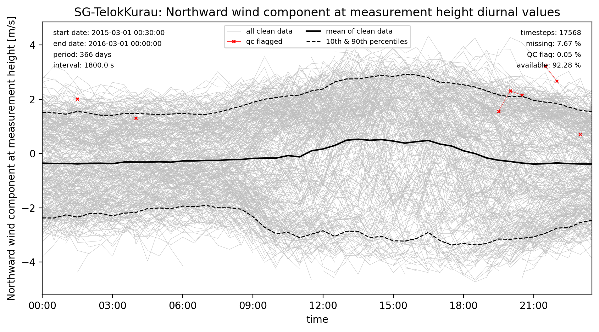

# SG-TelokKurau

## Site observations

|                           | observation_attributes                                                                                                                                                                                                                                                                    |
|:--------------------------|:------------------------------------------------------------------------------------------------------------------------------------------------------------------------------------------------------------------------------------------------------------------------------------------|
| title                     | URBAN-PLUMBER forcing data for SG-TelokKurau                                                                                                                                                                                                                                              |
| summary                   | Combined observational and ERA5-derived surface meteorological data for Telok Kurau, Singapore. For forcing of land surface models participating in Urban-PLUMBER. Data is for use by registered participants of Urban-PLUMBER in this project only. Do not distribute. All times in UTC. |
| sitename                  | SG-TelokKurau                                                                                                                                                                                                                                                                             |
| version                   | v1                                                                                                                                                                                                                                                                                        |
| conventions               | ALMA+CF.rev13                                                                                                                                                                                                                                                                             |
| featureType               | timeSeries                                                                                                                                                                                                                                                                                |
| time_coverage_start       | 2005-01-01 00:00:00                                                                                                                                                                                                                                                                       |
| time_coverage_end         | 2016-02-29 16:00:00                                                                                                                                                                                                                                                                       |
| time_analysis_start       | 2015-02-28 16:30:00                                                                                                                                                                                                                                                                       |
| time_shown_in             | UTC                                                                                                                                                                                                                                                                                       |
| local_utc_offset_hours    | 8.0                                                                                                                                                                                                                                                                                       |
| timestep_interval_seconds | 1800.0                                                                                                                                                                                                                                                                                    |
| timestep_number_spinup    | 178113                                                                                                                                                                                                                                                                                    |
| timestep_number_analysis  | 17568                                                                                                                                                                                                                                                                                     |
| date_created              | 2021-02-17 12:56:51                                                                                                                                                                                                                                                                       |
| project_contact           | Mathew Lipson: m.lipson@unsw.edu.au, Sue Grimmond: c.s.grimmond@reading.ac.uk, Martin Best: martin.best@metoffice.gov.uk                                                                                                                                                                  |
| observations_contact      | Eric Velasco: he_velasco2003@yahoo.com; Matthias Roth: geomr@nus.edu.sg                                                                                                                                                                                                                   |
| observations_reference    | Roth, Jansson and Velasco (2017) https://doi.org/10.1002/joc.4873; Velasco, Roth, Tan, Quak, Nabarro, Norford. (2013) https://doi.org/10.5194/acp-13-10185-2013; Flux tower website: https://www.nusurbanclimate.com/tkfluxtowersingapore                                                 |
| other_references          | ERA5: Copernicus Climate Change Service (C3S) (2017): https://cds.climate.copernicus.eu/cdsapp#!/home                                                                                                                                                                                     |
| acknowledgements          | Contains modified Copernicus Climate Change Service Information (ERA5 hourly data on single levels). With thanks to all involved in collecting, processing and sharing observational data                                                                                                 |

## Site characteristics

"View of TK study area towards SE from above in August 2017." source: Minghong Yu and Matthias Roth

|   id | parameter                       |     value | units         | source               | doi                                                                                                                        |
|-----:|:--------------------------------|----------:|:--------------|:---------------------|:---------------------------------------------------------------------------------------------------------------------------|
|    1 | latitude                        |    1.3143 | degrees_north | Roth et al. 2017     | [https://doi.org/10.1002/joc.4873](https://doi.org/10.1002/joc.4873)                                                       |
|    2 | longitude                       |  103.911  | degrees_east  | Roth et al. 2017     | [https://doi.org/10.1002/joc.4873](https://doi.org/10.1002/joc.4873)                                                       |
|    3 | ground_height                   |    5      | m             | Velasco et al. 2013  | [https://doi.org/10.5194/acp-13-10185-2013](https://doi.org/10.5194/acp-13-10185-2013)                                     |
|    4 | measurement_height_above_ground |   23.5    | m             | Tower website        | [https://www.nusurbanclimate.com/tkfluxtowersingapore](https://www.nusurbanclimate.com/tkfluxtowersingapore)               |
|    5 | impervious_area_fraction        |    0.85   | 1             | Tower website        | [https://www.nusurbanclimate.com/tkfluxtowersingapore](https://www.nusurbanclimate.com/tkfluxtowersingapore)               |
|    6 | tree_area_fraction              |    0.11   | 1             | Tower website        | [https://www.nusurbanclimate.com/tkfluxtowersingapore](https://www.nusurbanclimate.com/tkfluxtowersingapore)               |
|    7 | grass_area_fraction             |    0.04   | 1             | Tower website        | [https://www.nusurbanclimate.com/tkfluxtowersingapore](https://www.nusurbanclimate.com/tkfluxtowersingapore)               |
|    8 | bare_soil_area_fraction         |    0      | 1             | Tower website        | [https://www.nusurbanclimate.com/tkfluxtowersingapore](https://www.nusurbanclimate.com/tkfluxtowersingapore)               |
|    9 | water_area_fraction             |    0      | 1             | Tower website        | [https://www.nusurbanclimate.com/tkfluxtowersingapore](https://www.nusurbanclimate.com/tkfluxtowersingapore)               |
|   10 | roof_area_fraction              |    0.39   | 1             | Tower website        | [https://www.nusurbanclimate.com/tkfluxtowersingapore](https://www.nusurbanclimate.com/tkfluxtowersingapore)               |
|   11 | road_area_fraction              |    0.12   | 1             | Tower website        | [https://www.nusurbanclimate.com/tkfluxtowersingapore](https://www.nusurbanclimate.com/tkfluxtowersingapore)               |
|   12 | footpath_area_fraction          |    0.34   | 1             | Tower website        | [https://www.nusurbanclimate.com/tkfluxtowersingapore](https://www.nusurbanclimate.com/tkfluxtowersingapore)               |
|   13 | building_mean_height            |    9.9    | m             | Tower website        | [https://www.nusurbanclimate.com/tkfluxtowersingapore](https://www.nusurbanclimate.com/tkfluxtowersingapore)               |
|   14 | tree_mean_height                |    7.3    | m             | Tower website        | [https://www.nusurbanclimate.com/tkfluxtowersingapore](https://www.nusurbanclimate.com/tkfluxtowersingapore)               |
|   15 | roughness_length_momentum       |    0.8    | m             | Tower website        | [https://www.nusurbanclimate.com/tkfluxtowersingapore](https://www.nusurbanclimate.com/tkfluxtowersingapore)               |
|   16 | displacement_height             |    7.34   | m             | Tower website        | [https://www.nusurbanclimate.com/tkfluxtowersingapore](https://www.nusurbanclimate.com/tkfluxtowersingapore)               |
|   17 | canyon_height_width_ratio       |    0.61   | 1             | Demuzere et al. 2017 | [https://doi.org/10.1002/qj.3028](https://doi.org/10.1002/qj.3028)                                                         |
|   18 | wall_to_plan_area_ratio         |    0.66   | 1             | Liu et al. 2017      | [https://iopscience.iop.org/article/10.1088/1748-9326/aa7ee7](https://iopscience.iop.org/article/10.1088/1748-9326/aa7ee7) |
|   19 | average_albedo_at_midday        |    0.167  | 1             | Current data         | -                                                                                                                          |
|   20 | resident_population_density     | 7490      | person/km2    | Roth et al. 2017     | [https://doi.org/10.1002/joc.4873](https://doi.org/10.1002/joc.4873)                                                       |
|   21 | anthropogenic_heat_flux_mean    |   11      | W/m2          | Quah and Roth 2012   | [https://doi.org/10.1016/j.atmosenv.2011.10.015](https://doi.org/10.1016/j.atmosenv.2011.10.015)                           |
|   22 | topsoil_clay_fraction           |    0.33   | 1             | OpenLandMap          | [https://doi.org/10.5281/zenodo.2525663](https://doi.org/10.5281/zenodo.2525663)                                           |
|   23 | topsoil_sand_fraction           |    0.42   | 1             | OpenLandMap          | [https://doi.org/10.5281/zenodo.2525662](https://doi.org/10.5281/zenodo.2525662)                                           |
|   24 | topsoil_bulk_density            | 1030      | kg/m3         | OpenLandMap          | [https://doi.org/10.5281/zenodo.2525665](https://doi.org/10.5281/zenodo.2525665)                                           |

## Site observations

## Site forcing

### SWdown forcing

### LWdown forcing

### Tair forcing

### Qair forcing

### PSurf forcing

### Rainf forcing

### Snowf forcing

### Wind_N forcing

### Wind_E forcing

## Quality control (qc) and gap filling procedure

**QC process on observations**
 
 - remove values outside the ALMAv3 protocol expected range values
 - remove night periods for shortwave between civil twilight times for site latitude and longitude
 - remove constant values of 4 or more timesteps (excluding rainfall and snowfall)
 - remove outliers by applying a filter for values outside 5 standard deviations for each hour in a rolling 30 day window. Applying that filter until no outliers exist.
 
**Gap-filling process**
  
 - for gaps of 2 hours or less, fill with linear interpolation of adjacent observation
 - fill remaining gaps with bias-corrected, ERA5 derived data (see below)
 - prepend flux tower data period with 10-years of ERA5 derived data (used for model spinup)
 
**ERA5 bias correction**
 
 - for downwelling longwave, temperature, humidity and pressure: calculate the mean bias between ERA5 and flux tower data in a 30-day rolling window for every hour and each day of the year, and apply that bias correction to all ERA5 data. For periods not covered by observations, linearly interpoloate between known biases for each hour seperately.
 - for rainfall: calculate total precipitation in a 10-year period and calculate the ratio between ERA5 data and the nearest GHCN-D station and apply that correction factor to ERA5 data.
 - for wind: apply wind log profile correction based on ERA5 reference height (10m) and flux tower measurement heights, plus ERA5 and local roughness and displacement.
 - for downwelling shortwave: use ERA5 data without correction

### SWdown diurnal qc

### LWdown diurnal qc

### Tair diurnal qc

### Qair diurnal qc

### PSurf diurnal qc

### Wind_N diurnal qc

### Wind_E diurnal qc

### SWup diurnal qc

### LWup diurnal qc

### Qh diurnal qc

### Qle diurnal qc

