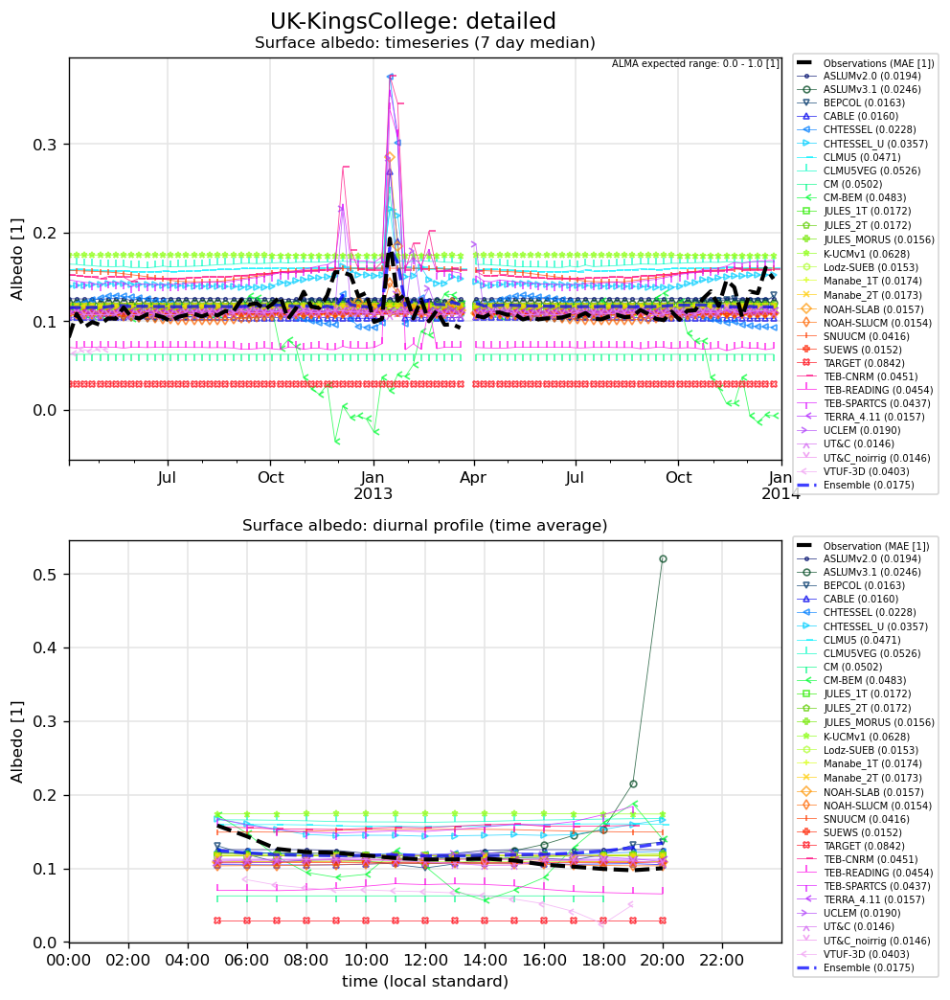

# UK-KingsCollege detailed results

**NOTE:** *Results presented here are highly dependent on how models are configured in this experiment and may be subject to variable output formatting errors. Results are not intended to indicate the quality of any individual model, but to help participants better understand and improve modelling approaches in different urban environments.*

### Jump to:
[variable definitions](../modelattrs/variable_definitions.md)

[SWup](#swup)
[LWup](#lwup)
[Qle](#qle)
[Qh](#qh)
[Qtau](#qtau)
[SWdown](#swdown)
[Qanth](#qanth)
[Qstor](#qstor)
[LAI](#lai)
[SnowFrac](#snowfrac)
[TairBuilding](#tairbuilding)
[TairSurf](#tairsurf)
[Albedo](#albedo)
[alb](#alb)

### SWup: Upwelling shortwave radiation flux (positive upward)

### LWup: Upwelling longwave radiation flux (positive upward)

### Qle: Latent heat flux (positive upward)

### Qh: Sensible heat flux (positive upward)

### Qtau: Momentum flux (positive downward)

### SWdown: Downward shortwave radiation at measurement height

### Qanth: Anthropogenic heat flux (positive upward)

### Qstor: Net storage heat flux in all materials (increase)

### LAI: Leaf area index

### SnowFrac: Snow covered fraction

### TairBuilding: Air temperature in buildings (bulk)

### TairSurf: Near surface air temperature (2m)

### Albedo: Surface albedo

### alb: Implied albedo calculated from SWdown and SWnet

### Jump to:
[variable definitions](../modelattrs/variable_definitions.md)

[SWup](#swup)
[LWup](#lwup)
[Qle](#qle)
[Qh](#qh)
[Qtau](#qtau)
[SWdown](#swdown)
[Qanth](#qanth)
[Qstor](#qstor)
[LAI](#lai)
[SnowFrac](#snowfrac)
[TairBuilding](#tairbuilding)
[TairSurf](#tairsurf)
[Albedo](#albedo)
[alb](#alb)

