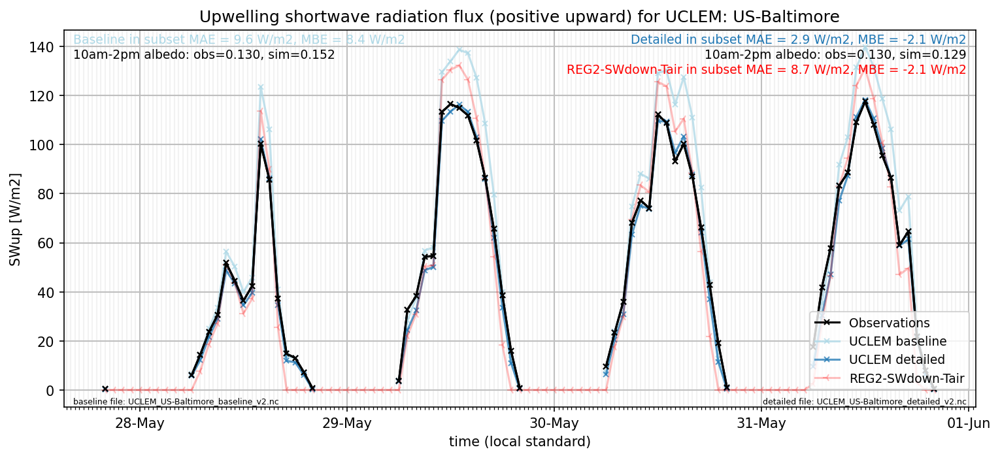

# US-Baltimore: UCLEM

**NOTE:** *Results presented here are highly dependent on how models are configured in this experiment and may be subject to variable output formatting errors. Results are not intended to indicate the quality of any individual model, but to help participants better understand and improve modelling approaches in different urban environments.*

### Submitted metadata

- [Baseline](UCLEM_US-Baltimore_baseline_attrs.md)
- [Detailed](UCLEM_US-Baltimore_detailed_attrs.md)

### Error metrics

| flux     | experiment   |        MAE |          MBE |        nSD |          R |          5th |      95th |       RMSE |      cRMSE |         AMBE |        1-nSD |         1-R |   nSkewness |   nKurtosis |     Overlap |
|:---------|:-------------|-----------:|-------------:|-----------:|-----------:|-------------:|----------:|-----------:|-----------:|-------------:|-------------:|------------:|------------:|------------:|------------:|
| SWup     | baseline     |  12.8567   |  10.8392     |   1.34396  |   0.967906 |   0.027      |  30.9639  |  18.6421   |   0.452297 |  10.8392     |   0.343959   |   0.0320936 |   0.166425  |   0.0957523 |   0.147495  |
| SWup     | detailed     |   6.4932   |   2.2887     |   1.15644  |   0.943057 |   0.2078     |   9.4699  |  13.4482   |   0.395187 |   2.2887     |   0.156435   |   0.0569425 |   0.819532  |   2.75427   |   0.0733329 |
| LWup     | baseline     |  17.4535   |  15.4303     |   1.24742  |   0.972709 |   0.459895   |  52.7017  |  25.1596   |   0.35959  |  15.4303     |   0.247423   |   0.0272908 |   6.43173   |   0.425061  |   0.0812164 |
| LWup     | detailed     |  17.3599   |   7.84324    |   1.28111  |   0.957857 |  10.9088     |  51.596   |  25.1525   |   0.43244  |   7.84324    |   0.281113   |   0.0421426 |   7.60485   |   0.610506  |   0.0851685 |
| Qle      | baseline     |  27.5195   | -12.4363     |   0.844851 |   0.779864 |  12.6624     |  43.1206  |  47.1914   |   0.629313 |  12.4363     |   0.155149   |   0.220136  |   0.420579  |   2.09775   |   0.266972  |
| Qle      | detailed     |  27.3348   |  -4.57801    |   0.995539 |   0.795755 |   9.2864     |  10.2888  |  46.3581   |   0.637721 |   4.57801    |   0.00446142 |   0.204245  |   0.36215   |   0.845718  |   0.281217  |
| Qh       | baseline     |  35.4645   |   1.93265    |   0.71748  |   0.785017 |  23.3524     |  66.1669  |  55.2927   |   0.623145 |   1.93265    |   0.282521   |   0.214983  |   0.13875   |   1.47888   |   0.268843  |
| Qh       | detailed     |  30.6806   |   6.88745    |   0.912585 |   0.83359  |  20.6712     |  20.3584  |  49.9593   |   0.558003 |   6.88745    |   0.0874166  |   0.16641   |   0.0523771 |   0.474251  |   0.153597  |
| SoilTemp | baseline     | nan        | nan          | nan        | nan        | nan          | nan       | nan        | nan        | nan          | nan          | nan         | nan         | nan         | nan         |
| SoilTemp | detailed     | nan        | nan          | nan        | nan        | nan          | nan       | nan        | nan        | nan          | nan          | nan         | nan         | nan         | nan         |
| Qtau     | baseline     |   0.108991 |   0.00893636 |   0.760413 |   0.848599 |   0.0238201  |   0.16232 |   0.162809 |   0.536337 |   0.00893636 |   0.239587   |   0.151401  |   0.247985  |   1.64296   |   0.243321  |
| Qtau     | detailed     |   0.158827 |  -0.142151   |   0.513751 |   0.613839 |   0.00147993 |   0.54052 |   0.279964 |   0.795751 |   0.142151   |   0.48625    |   0.386161  |   4.9824    |  45.3955    |   0.278575  |

 - MAE: mean absolute error (close to 0 is better)
 - MBE: mean bias error (close to 0 is better)
 - NSD: ratio of model to obs standard deviation (close to 1 is better)
 - R: Pearson's correlation (close to 1 is better)
 - all others: closer to 0 is better

[Link to variable definitions](../modelattrs/variable_definitions.md)

### subset_SWup_v0-9

### out of range: baseline

 - UCLEM Qh max value of 695.5190 is greater than expected 600.0 [W/m2]
 - UCLEM Qle min value of -1192.9636 is less than expected -700.0 [W/m2]

### out of range: detailed

 - UCLEM Qh max value of 747.7513 is greater than expected 600.0 [W/m2]
 - UCLEM Qle max value of 713.1661 is greater than expected 700.0 [W/m2]
 - UCLEM Qle min value of -1160.5034 is less than expected -700.0 [W/m2]

[Link to variable definitions](../modelattrs/variable_definitions.md)

