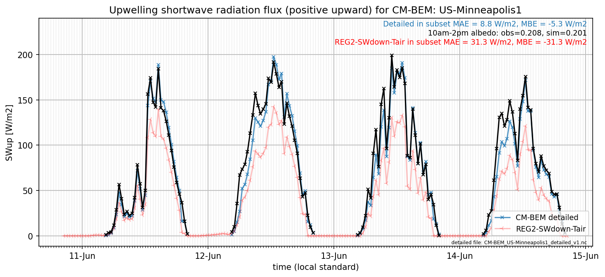

# US-Minneapolis1: CM-BEM

**NOTE:** *Results presented here are highly dependent on how models are configured in this experiment and may be subject to variable output formatting errors. Results are not intended to indicate the quality of any individual model, but to help participants better understand and improve modelling approaches in different urban environments.*

### Submitted metadata

- [Baseline](CM-BEM_US-Minneapolis1_baseline_attrs.md)
- [Detailed](CM-BEM_US-Minneapolis1_detailed_attrs.md)

### Error metrics

| flux     | experiment   |      MAE |       MBE |        nSD |          R |      5th |     95th |     RMSE |      cRMSE |      AMBE |       1-nSD |         1-R |   nSkewness |   nKurtosis |    Overlap |
|:---------|:-------------|---------:|----------:|-----------:|-----------:|---------:|---------:|---------:|-----------:|----------:|------------:|------------:|------------:|------------:|-----------:|
| SWup     | baseline     | nan      | nan       | nan        | nan        | nan      | nan      | nan      | nan        | nan       | nan         | nan         | nan         | nan         | nan        |
| SWup     | detailed     |  35.2426 | -32.8962  |   0.55981  |   0.653975 |   1.2161 | 133.981  |  80.8256 |   0.762354 |  32.8962  |   0.440191  |   0.346025  |   0.647212  |   1.15364   |   0.116886 |
| LWup     | baseline     | nan      | nan       | nan        | nan        | nan      | nan      | nan      | nan        | nan       | nan         | nan         | nan         | nan         | nan        |
| LWup     | detailed     |  11.4766 |  -6.27476 |   0.907384 |   0.984824 |   5.4565 |  18.9125 |  15.1408 |   0.190048 |   6.27476 |   0.0926163 |   0.0151757 |   0.384717  |   0.517672  |   0.071116 |
| Qle      | baseline     | nan      | nan       | nan        | nan        | nan      | nan      | nan      | nan        | nan       | nan         | nan         | nan         | nan         | nan        |
| Qle      | detailed     |  40.2557 |  35.2616  |   1.85939  |   0.73838  |   6.9    | 137.875  |  80.7641 |   1.30822  |  35.2616  |   0.859389  |   0.26162   |   2.66224   |  38.814     |   0.308852 |
| Qh       | baseline     | nan      | nan       | nan        | nan        | nan      | nan      | nan      | nan        | nan       | nan         | nan         | nan         | nan         | nan        |
| Qh       | detailed     |  39.64   |   4.31757 |   0.593991 |   0.801268 |  33.201  |  72.1752 |  53.3769 |   0.633193 |   4.31757 |   0.40601   |   0.198732  |   0.0575934 |   0.0144845 |   0.400997 |
| Qg       | baseline     | nan      | nan       | nan        | nan        | nan      | nan      | nan      | nan        | nan       | nan         | nan         | nan         | nan         | nan        |
| Qg       | detailed     |  24.7517 |   1.07634 |   1.19407  |   0.767308 |  14.6275 |   4.7902 |  34.4114 |   0.770303 |   1.07634 |   0.194064  |   0.232692  |   0.502062  |   0.945508  |   0.231889 |
| Qtau     | baseline     | nan      | nan       | nan        | nan        | nan      | nan      | nan      | nan        | nan       | nan         | nan         | nan         | nan         | nan        |
| Qtau     | detailed     | nan      | nan       | nan        | nan        | nan      | nan      | nan      | nan        | nan       | nan         | nan         | nan         | nan         | nan        |
| SoilTemp | baseline     | nan      | nan       | nan        | nan        | nan      | nan      | nan      | nan        | nan       | nan         | nan         | nan         | nan         | nan        |
| SoilTemp | detailed     | nan      | nan       | nan        | nan        | nan      | nan      | nan      | nan        | nan       | nan         | nan         | nan         | nan         | nan        |

 - MAE: mean absolute error (close to 0 is better)
 - MBE: mean bias error (close to 0 is better)
 - NSD: ratio of model to obs standard deviation (close to 1 is better)
 - R: Pearson's correlation (close to 1 is better)
 - all others: closer to 0 is better

[Link to variable definitions](../modelattrs/variable_definitions.md)

### subset_SWup_v0-9

### out of range: baseline

### out of range: detailed

 - CM-BEM Qanth max value of 2140.4500 is greater than expected 1000.0 [W/m2]
 - CM-BEM Qanth min value of -1607.4400 is less than expected 0.0 [W/m2]
 - CM-BEM SWnet min value of -90.9762 is less than expected 0.0 [W/m2]
 - CM-BEM Qle max value of 4860.8066 is greater than expected 700.0 [W/m2]
 - CM-BEM Qle min value of -843.2284 is less than expected -700.0 [W/m2]

[Link to variable definitions](../modelattrs/variable_definitions.md)

