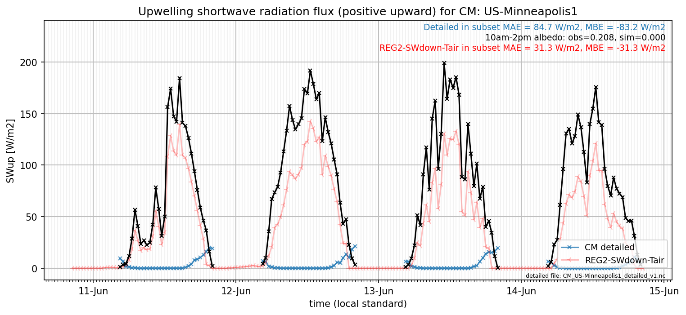

# US-Minneapolis1: CM

**NOTE:** *Results presented here are highly dependent on how models are configured in this experiment and may be subject to variable output formatting errors. Results are not intended to indicate the quality of any individual model, but to help participants better understand and improve modelling approaches in different urban environments.*

### Submitted metadata

- [Baseline](CM_US-Minneapolis1_baseline_attrs.md)
- [Detailed](CM_US-Minneapolis1_detailed_attrs.md)

### Error metrics

| flux     | experiment   |      MAE |       MBE |         nSD |          R |     5th |    95th |     RMSE |      cRMSE |      AMBE |      1-nSD |        1-R |   nSkewness |   nKurtosis |    Overlap |
|:---------|:-------------|---------:|----------:|------------:|-----------:|--------:|--------:|---------:|-----------:|----------:|-----------:|-----------:|------------:|------------:|-----------:|
| SWup     | baseline     | nan      | nan       | nan         | nan        | nan     | nan     | nan      | nan        | nan       | nan        | nan        |  nan        |  nan        | nan        |
| SWup     | detailed     |  96.8908 | -96.215   |   0.0371989 |  -0.231692 |   2.5   | 293.86  | 137.156  |   1.00927  |  96.215   |   0.962801 |   1.23169  |    1.04572  |    2.16524  |   0.802695 |
| LWup     | baseline     | nan      | nan       | nan         | nan        | nan     | nan     | nan      | nan        | nan       | nan        | nan        |  nan        |  nan        | nan        |
| LWup     | detailed     |  48.6185 |  16.9617  |   1.16474   |   0.671332 |  12.85  |  51.91  |  66.7563 |   0.890373 |  16.9617  |   0.164732 |   0.328668 |    1.53702  |    0.980888 |   0.084314 |
| Qle      | baseline     | nan      | nan       | nan         | nan        | nan     | nan     | nan      | nan        | nan       | nan        | nan        |  nan        |  nan        | nan        |
| Qle      | detailed     |  38.0297 | -16.0935  |   0.47493   |  -0.155769 |   4.048 |  84.113 |  67.0754 |   1.17197  |  16.0935  |   0.52507  |   1.15577  |    0.263517 |    0.409029 |   0.235506 |
| Qh       | baseline     | nan      | nan       | nan         | nan        | nan     | nan     | nan      | nan        | nan       | nan        | nan        |  nan        |  nan        | nan        |
| Qh       | detailed     |  83.0573 | -10.2579  |   0.477715  |  -0.443512 |  39.194 |  97.577 | 108.46   |   1.28528  |  10.2579  |   0.522286 |   1.44351  |    0.281082 |    0.758658 |   0.496689 |
| Qg       | baseline     | nan      | nan       | nan         | nan        | nan     | nan     | nan      | nan        | nan       | nan        | nan        |  nan        |  nan        | nan        |
| Qg       | detailed     |  80.4519 |  -3.37703 |   1.82102   |  -0.37855  |  45.269 |  62.87  | 106.608  |   2.38638  |   3.37703 |   0.821013 |   1.37855  |    0.567128 |    0.866779 |   0.348888 |
| Qtau     | baseline     | nan      | nan       | nan         | nan        | nan     | nan     | nan      | nan        | nan       | nan        | nan        |  nan        |  nan        | nan        |
| Qtau     | detailed     | nan      | nan       | nan         | nan        | nan     | nan     | nan      | nan        | nan       | nan        | nan        |  nan        |  nan        | nan        |
| SoilTemp | baseline     | nan      | nan       | nan         | nan        | nan     | nan     | nan      | nan        | nan       | nan        | nan        |  nan        |  nan        | nan        |
| SoilTemp | detailed     | nan      | nan       | nan         | nan        | nan     | nan     | nan      | nan        | nan       | nan        | nan        |  nan        |  nan        | nan        |

 - MAE: mean absolute error (close to 0 is better)
 - MBE: mean bias error (close to 0 is better)
 - NSD: ratio of model to obs standard deviation (close to 1 is better)
 - R: Pearson's correlation (close to 1 is better)
 - all others: closer to 0 is better

[Link to variable definitions](../modelattrs/variable_definitions.md)

### subset_SWup_v0-9

### out of range: baseline

### out of range: detailed

 - CM Qstor min value of -1422.0100 is less than expected -800.0 [W/m2]
 - CM Qg max value of 512.5000 is greater than expected 500.0 [W/m2]
 - CM Qg min value of -1422.0100 is less than expected -500.0 [W/m2]
 - CM SWnet min value of -32.1900 is less than expected 0.0 [W/m2]
 - CM Qle max value of 735.3100 is greater than expected 700.0 [W/m2]

[Link to variable definitions](../modelattrs/variable_definitions.md)

