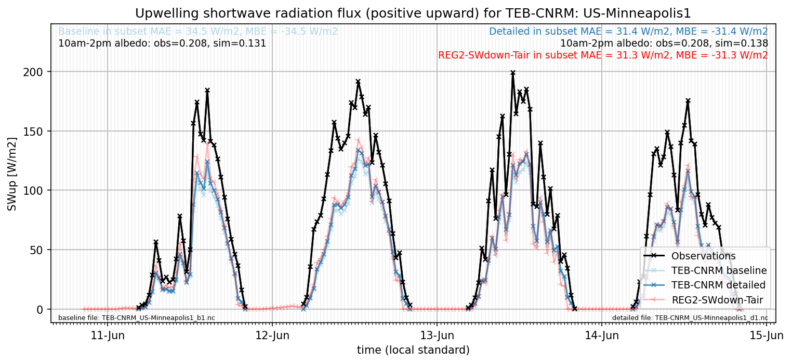

# US-Minneapolis1: TEB-CNRM

**NOTE:** *Results presented here are highly dependent on how models are configured in this experiment and may be subject to variable output formatting errors. Results are not intended to indicate the quality of any individual model, but to help participants better understand and improve modelling approaches in different urban environments.*

### Submitted metadata

- [Baseline](TEB-CNRM_US-Minneapolis1_baseline_attrs.md)
- [Detailed](TEB-CNRM_US-Minneapolis1_detailed_attrs.md)

### Error metrics

| flux     | experiment   |       MAE |         MBE |      nSD |        R |        5th |       95th |      RMSE |    cRMSE |       AMBE |     1-nSD |        1-R |   nSkewness |   nKurtosis |   Overlap |
|:---------|:-------------|----------:|------------:|---------:|---------:|-----------:|-----------:|----------:|---------:|-----------:|----------:|-----------:|------------:|------------:|----------:|
| SWup     | baseline     | 46.108    | -43.5689    | 0.512538 | 0.880589 |  2.3574    | 156.87     | 72.6257   | 0.600021 | 43.5689    | 0.487463  | 0.119411   |  0.373903   |   0.709372  | 0.212606  |
| SWup     | detailed     | 38.7915   | -34.4434    | 0.613932 | 0.91462  |  2.33442   | 120.156    | 59.7262   | 0.503869 | 34.4434    | 0.386069  | 0.0853802  |  0.284329   |   0.56896   | 0.178443  |
| LWup     | baseline     | 10.9076   |   8.96481   | 1.06136  | 0.990761 |  8.96321   |  21.6891   | 14.257    | 0.1529   |  8.96481   | 0.0613624 | 0.00923948 |  0.434398   |   0.0748606 | 0.0874987 |
| LWup     | detailed     |  8.30724  |   0.30463   | 0.967743 | 0.987107 |  6.22576   |   6.98565  | 11.6938   | 0.161231 |  0.30463   | 0.0322584 | 0.0128934  |  0.229014   |   0.467563  | 0.0649852 |
| Qle      | baseline     | 19.2373   |  -0.662676  | 0.893861 | 0.738658 |  4.33927   |  10.1586   | 38.424    | 0.691717 |  0.662676  | 0.106139  | 0.261342   |  0.0093582  |   0.205298  | 0.16227   |
| Qle      | detailed     | 24.3767   |   2.80539   | 1.20064  | 0.608663 |  4.02963   |   6.28418  | 55.053    | 0.989935 |  2.80539   | 0.200644  | 0.391337   |  0.867907   |   3.01815   | 0.0594694 |
| Qh       | baseline     | 49.7656   |  44.0703    | 1.13227  | 0.876045 | 27.8043    |  67.1128   | 63.616    | 0.546072 | 44.0703    | 0.132265  | 0.123955   |  0.00867145 |   0.0740572 | 0.327345  |
| Qh       | detailed     | 36.003    |  20.4327    | 1.11966  | 0.836778 | 18.3333    |  35.6297   | 55.6639   | 0.616297 | 20.4327    | 0.119654  | 0.163222   |  0.141724   |   1.46968   | 0.253672  |
| Qg       | baseline     | 33.7732   |  -0.934448  | 1.62394  | 0.771996 | 38.8693    |  42.3267   | 47.4698   | 1.06294  |  0.934448  | 0.623932  | 0.228004   |  0.504778   |   0.916722  | 0.329988  |
| Qg       | detailed     | 35.7538   |  -0.412386  | 1.65583  | 0.705872 | 28.8906    |  47.5494   | 52.9112   | 1.18497  |  0.412386  | 0.655817  | 0.294128   |  0.0528453  |   0.0193444 | 0.274483  |
| Qtau     | baseline     |  0.127718 |   0.0996199 | 1.15897  | 0.869783 |  0.0505772 |   0.187632 |  0.165847 | 0.571934 |  0.0996199 | 0.158973  | 0.130217   |  0.0771     |   0.266493  | 0.187704  |
| Qtau     | detailed     |  0.163268 |   0.146995  | 1.4052   | 0.881604 |  0.0282525 |   0.34501  |  0.219809 | 0.70493  |  0.146995  | 0.405196  | 0.118396   |  0.0488087  |   0.17899   | 0.212932  |
| SoilTemp | baseline     |  4.5199   |  -2.50336   | 1.27581  | 0.932435 | 10.6256    |   2.37582  |  5.82725  | 0.498468 |  2.50336   | 0.27581   | 0.0675654  |  5.77781    |   0.474265  | 0.233985  |
| SoilTemp | detailed     |  4.99921  |  -3.00203   | 1.30189  | 0.930186 | 10.9541    |   2.86981  |  6.27909  | 0.522419 |  3.00203   | 0.301897  | 0.0698143  |  3.97058    |   0.432369  | 0.231263  |

 - MAE: mean absolute error (close to 0 is better)
 - MBE: mean bias error (close to 0 is better)
 - NSD: ratio of model to obs standard deviation (close to 1 is better)
 - R: Pearson's correlation (close to 1 is better)
 - all others: closer to 0 is better

[Link to variable definitions](../modelattrs/variable_definitions.md)

### subset_SWup_v0-9

### out of range: baseline

### out of range: detailed

 - TEB-CNRM Qh max value of 703.7618 is greater than expected 600.0 [W/m2]
 - TEB-CNRM Qh min value of -629.4464 is less than expected -600.0 [W/m2]
 - TEB-CNRM Qle max value of 1063.0913 is greater than expected 700.0 [W/m2]

[Link to variable definitions](../modelattrs/variable_definitions.md)

