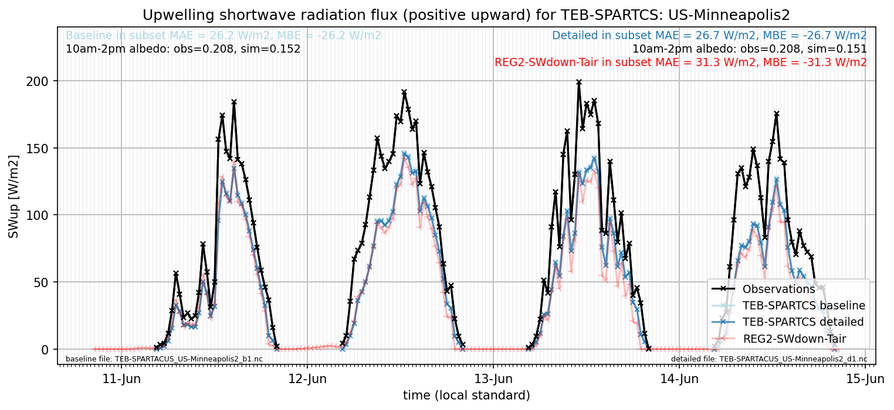

# US-Minneapolis2: TEB-SPARTCS

**NOTE:** *Results presented here are highly dependent on how models are configured in this experiment and may be subject to variable output formatting errors. Results are not intended to indicate the quality of any individual model, but to help participants better understand and improve modelling approaches in different urban environments.*

### Submitted metadata

- [Baseline](TEB-SPARTCS_US-Minneapolis2_baseline_attrs.md)
- [Detailed](TEB-SPARTCS_US-Minneapolis2_detailed_attrs.md)

### Error metrics

| flux     | experiment   |        MAE |         MBE |      nSD |        R |         5th |       95th |      RMSE |    cRMSE |       AMBE |      1-nSD |        1-R |   nSkewness |   nKurtosis |   Overlap |
|:---------|:-------------|-----------:|------------:|---------:|---------:|------------:|-----------:|----------:|---------:|-----------:|-----------:|-----------:|------------:|------------:|----------:|
| SWup     | baseline     | 44.3744    | -44.204     | 0.470548 | 0.845196 |  2.35874    | 168.193    | 77.1297   | 0.65269  | 44.204     | 0.529452   | 0.154804   |  0.638521   |    1.1057   | 0.192475  |
| SWup     | detailed     | 41.37      | -41.0638    | 0.492525 | 0.855734 |  2.31168    | 162.534    | 73.7156   | 0.632171 | 41.0638    | 0.507476   | 0.144266   |  0.644243   |    1.09866  | 0.175033  |
| LWup     | baseline     |  8.88143   |   7.26445   | 1.0118   | 0.992504 |  9.29175    |  10.1104   | 11.5432   | 0.123727 |  7.26445   | 0.0118005  | 0.00749612 |  0.121456   |    0.119562 | 0.0670086 |
| LWup     | detailed     |  8.29758   |   4.83491   | 1.00172  | 0.990801 |  7.41369    |   4.22944  | 10.967    | 0.135769 |  4.83491   | 0.0017221  | 0.00919925 |  0.0342931  |    0.285717 | 0.0655813 |
| Qle      | baseline     | 28.3935    |  -0.152805  | 1.00739  | 0.757452 |  3.45947    |   5.8624   | 53.8955   | 0.699096 |  0.152805  | 0.00738844 | 0.242548   |  0.0172482  |    0.116945 | 0.126104  |
| Qle      | detailed     | 33.79      |   0.940209  | 1.29204  | 0.698228 |  7.22477    |  27.9993   | 71.7105   | 0.930105 |  0.940209  | 0.292044   | 0.301772   |  0.542685   |    1.81961  | 0.179239  |
| Qh       | baseline     | 40.6675    |  30.1282    | 1.40591  | 0.815494 |  8.95547    |  89.1173   | 60.4584   | 0.826776 | 30.1282    | 0.405908   | 0.184506   |  0.244761   |    0.204467 | 0.199614  |
| Qh       | detailed     | 43.1976    |  21.2225    | 1.67695  | 0.715911 |  3.67958    |  78.6037   | 78.2436   | 1.18788  | 21.2225    | 0.676949   | 0.284089   |  0.0915803  |    2.01406  | 0.219158  |
| Qg       | baseline     | 34.2316    |  -0.653509  | 1.59215  | 0.726304 | 39.4505     |  34.0509   | 49.3663   | 1.10552  |  0.653509  | 0.592142   | 0.273696   |  0.536577   |    0.859143 | 0.320818  |
| Qg       | detailed     | 41.363     |  -0.383088  | 1.74183  | 0.525712 | 32.0126     |  43.437    | 66.267    | 1.4841   |  0.383088  | 0.741814   | 0.474288   |  0.00175995 |    0.623008 | 0.265942  |
| Qtau     | baseline     |  0.0948884 |  -0.0228976 | 0.749294 | 0.857765 |  0.0184144  |   0.165991 |  0.143626 | 0.525362 |  0.0228976 | 0.250707   | 0.142235   |  0.133327   |    0.277644 | 0.144293  |
| Qtau     | detailed     |  0.119184  |   0.0697358 | 1.22353  | 0.88567  |  0.00364163 |   0.167232 |  0.169943 | 0.574225 |  0.0697358 | 0.223525   | 0.11433    |  0.10238    |    0.208733 | 0.123525  |
| SoilTemp | baseline     |  4.8094    |  -2.7061    | 1.26908  | 0.925253 | 10.3632     |   2.63825  |  6.0444   | 0.511982 |  2.7061    | 0.269085   | 0.0747474  |  4.39667    |    0.500001 | 0.23931   |
| SoilTemp | detailed     |  5.38269   |  -3.30141   | 1.28462  | 0.914518 | 10.9517     |   2.33921  |  6.6635   | 0.548299 |  3.30141   | 0.284621   | 0.0854824  |  3.69291    |    0.470558 | 0.238076  |

 - MAE: mean absolute error (close to 0 is better)
 - MBE: mean bias error (close to 0 is better)
 - NSD: ratio of model to obs standard deviation (close to 1 is better)
 - R: Pearson's correlation (close to 1 is better)
 - all others: closer to 0 is better

[Link to variable definitions](../modelattrs/variable_definitions.md)

### subset_SWup_v0-9

### out of range: baseline

### out of range: detailed

 - TEB-SPARTCS Qh max value of 880.4586 is greater than expected 600.0 [W/m2]
 - TEB-SPARTCS Qh min value of -864.5627 is less than expected -600.0 [W/m2]
 - TEB-SPARTCS Qle max value of 1086.8230 is greater than expected 700.0 [W/m2]

[Link to variable definitions](../modelattrs/variable_definitions.md)

