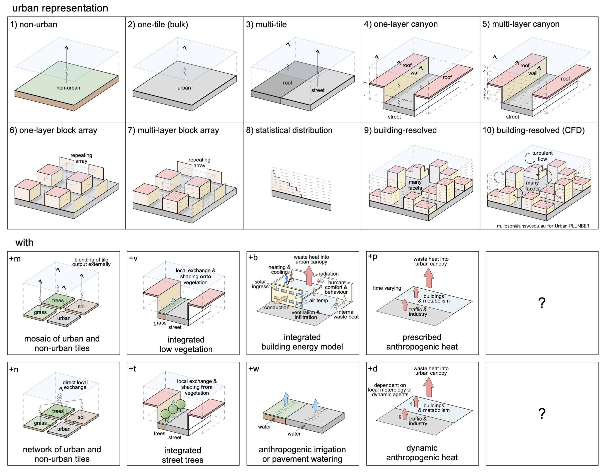
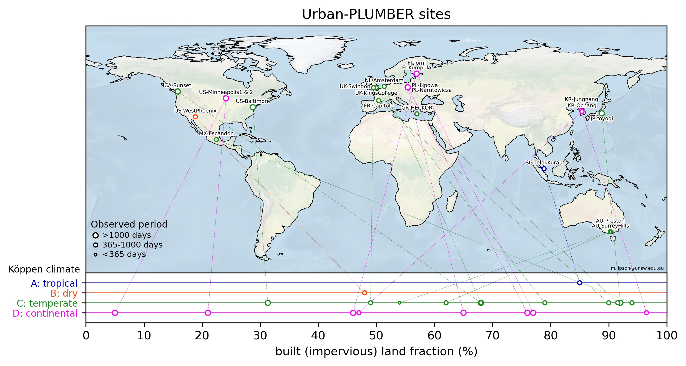

**Urban-PLUMBER will evaluate the performance of land surface models used in in meteorological or climatic simulations of urban areas. The project is open to any group that wishes to gain a better understanding of how their model performs in a wide range of urban environments.**

Previous urban model evaluation projects have assessed how model complexity affects prediction of land-atmosphere energy exchange at two urban sites (Grimmond et al., 2010, 2011), and how coupled surface-atmosphere simulations differ from offline simulations (Steeneveld et al., 2017). In non-urban landscapes, the PLUMBER project introduced a framework for benchmarking models across many sites (Best et al., 2015).

Building on these methods, Urban-PLUMBER will ask: 

1. How have the last decade of model development affected performance? 
2. Where do different modelling approaches excel across the urbanised/vegetated continuum?
3. How does more detailed morphology information affect model performance?
4. Are models utilising available meteorological information effectively?

## Scope

The project has two phases:

- Phase 1. a single site evaluation to ensure participants are comfortable with the configuration, submission and evaluation process. Initial submissions are due 31 August 2020.
- Phase 2. a multi-site evaluation across a range of increasingly urbanised sites.

## Outputs

- Paper: [*Harmonized gap-filled datasets from 20 urban flux tower sites*](https://doi.org/10.5194/essd-14-5157-2022), ESSD, 2022
- Dataset: [*Data for "Harmonized gap-filled dataset from 20 urban flux tower sites" for the Urban-PLUMBER project*](https://doi.org/10.5281/zenodo.7104984), Zenodo, 2022
- Paper: *Evaluation of 30 urban land surface models in the Urban-PLUMBER project: Phase 1 results (in review)*
- Paper: *Phase 2 results (in prep.)*
- [Modelling protocol](https://urban-plumber.github.io/static/Urban-PLUMBER_protocol_v1.pdf)
- [Observational protocol](https://urban-plumber.github.io/static/Urban-PLUMBER_observations_protocol_v1.pdf)

## Observations

Observational scientists have contributed 20 flux tower datasets from around the world. This has been synthesised, quality controlled and gap filled.
More [details here](sites.md).

## Phase 1

Phase 1 has been completed. 30 models participated, from non-urbanised LSMs and simple slab schemes, through to multi-layer canopy and building resolving models.

The evaluation was undertaken at one suburban site in Melbourne, Australia, the same used in the first evaluation project 10 years ago (Grimmond et al., 2011), allowing an assessment of how model development has affected performance.

## Phase 2

Phase 2 of the project (underway) includes 20 sites across a range of urban fractions. More [details here](sites.md).

## Acknowledgements
We gratefully acknowledge those who have supported this project, provided valuable feedback and offered observational datasets including 
Ahmed Balogun, Alberto Martilli, Andreas Christen, Andres Simon, Andy Coutts, Andy Pitman, Aristofanis Tsiringakis, Aude Lemonsu, Beom-Soon Han, Chenghao Wang, Cécile De Munck, David Meyer, David Reed, Dieter Scherer, Doo-Il Lee, Erik Velasco, Fred Meier, Gab Abramowitz, Gabriel Manoli, Gert-Jan Steeneveld, Helen Ward, Hendrik Wouters, Hiroaki Kondo, Hirofumi Sugawara, Ian Strachan, Je-Woo Hong, Jenny Salmond, Jimmy Adegoke, Jinkyu Hong, Joe McFadden, Joe McNorton, Jong-Jin Baik, Junxia Dou, Keith Oleson, Kerry Nice, Kim Novick, Krzysztof Fortuniak, Leena Järvi, Lena Weissert, Maggie Hendry, Marcus Thatcher, Martin De Kauwe, Matthias Demuzere, Matthias Roth, Meiring Beyers, Michael Roth, Naika Meili, Nektarios Chrysoulakis, Nigel Tapper, Ning Zhang, Rachel Spronken-Smith, Robert Schoetter, Sang-Hyun Lee, Seung-Bu Park, Shiguang Miao, Simone Fatichi, Simone Kotthaus, Souhail Boussetta, Stevan Earl, Tiago Machado, Ting Sun, Valéry Masson, Winston Chow, Włodzimierz Pawlak, Yurong Shi, Yuya Takane, Zhihua Wang, Zutao Yang.

## References

1. Grimmond, C. S. B., Blackett, M., Best, M. J., Barlow, J., Baik, J.-J., Belcher, S. E., Bohnenstengel, S. I., Calmet, I., Chen, F., Dandou, A., Fortuniak, K., Gouvea, M. L., Hamdi, R., Hendry, M., Kawai, T., Kawamoto, Y., Kondo, H., Krayenhoff, E. S., Lee, S.-H. and Loridan, T.: The International Urban Energy Balance Models Comparison Project: First Results from Phase 1, Journal of Applied Meteorology & Climatology, 49(6), 1268–1292, doi:10.1175/2010JAMC2354.1, 2010.
2. Grimmond, C. S. B., Blackett, M., Best, M. J., Baik, J.-J., Belcher, S. E., Beringer, J., Bohnenstengel, S. I., Calmet, I., Chen, F., Coutts, A., Dandou, A., Fortuniak, K., Gouvea, M. L., Hamdi, R., Hendry, M., Kanda, M., Kawai, T., Kawamoto, Y., Kondo, H., Krayenhoff, E. S., Lee, S.-H., Loridan, T., Martilli, A., Masson, V., Miao, S., Oleson, K., Ooka, R., Pigeon, G., Porson, A., Ryu, Y.-H., Salamanca, F., Steeneveld, G. j., Tombrou, M., Voogt, J. A., Young, D. T. and Zhang, N.: Initial results from Phase 2 of the international urban energy balance model comparison, International Journal of Climatology, 31(2), 244–272, doi:10.1002/joc.2227, 2011.
3. Steeneveld, G., Tsiringakis, A., Barlow, J., Bohnenstengel, S., Grimmond, S., Halios, C., van Haren, R., Kotthaus, S., Masson, V., van den Oord, G. and others: Single-column urban boundary layer inter-comparison modelling experiment (SUBLIME): Call for participation, Urban Climate News: Quarterly Newsletter of the IAUC, 66, 21–26, 2017.
4. Best, M. J., Abramowitz, G., Johnson, H. R., Pitman, A. J., Balsamo, G., Boone, A., Cuntz, M., Decharme, B., Dirmeyer, P. A., Dong, J., Ek, M., Guo, Z., Haverd, V., van den Hurk, B. J. J., Nearing, G. S., Pak, B., Peters-Lidard, C., Santanello, J. A., Stevens, L. and Vuichard, N.: The Plumbing of Land Surface Models: Benchmarking Model Performance, J. Hydrometeor, 16(3), 1425–1442, doi:10.1175/JHM-D-14-0158.1, 2015.

